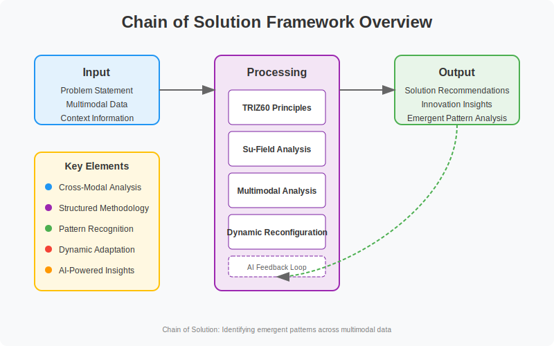

# Chain of Solution (CoS) Framework

An advanced AI framework integrating multiple problem-solving methodologies with large language models to detect and solve complex problems across multimodal data.



## Overview

The Chain of Solution (CoS) is a novel framework that transcends traditional problem-solving methodologies by detecting patterns that emerge specifically from cross-modal data interactions. Unlike sequential reasoning approaches like Chain of Thought (CoT), CoS organizes problems across different scales through innovative feature engineering that captures relationships between modalities (text, sound, images).

This structured approach enables systematic identification of contradictions and their resolution through principled methods rather than unstructured reasoning, integrating TRIZ problem-solving methodology with multimodal data analysis to identify critical patterns that emerge only from interactions between different data types.

## Key Innovations

- **Cross-Modal Pattern Detection**: Identifies patterns that emerge specifically from interactions between different data modalities
- **Integrated Problem-Solving Methodologies**: Combines TRIZ, Su-Field analysis, and other structured approaches
- **Multi-Scale Analysis**: Organizes problems across different scales for comprehensive understanding
- **LLM Integration**: Implements the CoS framework within Large Language Models for enhanced reasoning


## Extended TRIZ60 Principles

The framework extends the traditional 40 TRIZ principles to 60 principles (TRIZ60), adding innovations for modern technological challenges.


## Core Components

- **TRIZ Engine**: Implements the extended TRIZ60 principles and Su-Field 100 standard solutions
- **Multimodal Analysis Engine**: Detects patterns across different modalities (text, images, audio, etc.)
- **LLM Integration**: Seamlessly integrates with large language models for enhanced reasoning
- **Applications**: Specialized modules for different domains (medical, sound analysis, image enhancement)

## Applications

The CoS framework has been implemented in three key areas:

1. **Digital Pathology (CellStyle™)**: Integrates microscopic and clinical data to reveal multi-scale disease patterns
2. **Sound Analysis (SoundPose™)**: Structures acoustic features to identify health conditions
3. **Image Enhancement**: Uses feature interactions for contextual reconstruction

When applied to the Alzheimer's Disease Neuroimaging Initiative (ADNI) database, our approach demonstrated 25% greater prediction accuracy compared to existing methods and enabled discovery of novel inter-modality markers undetectable through conventional single-modality analyses.


## Repository Structure

- **`/src`**: Source code for the CoS framework implementation
- **`/doc`**: Comprehensive documentation
- **`/examples`**: Usage examples and demonstrations
- **`/deployment`**: Deployment and simulation resources
- **`/Scientific_papers`**: Summaries of related scientific literature

## Installation

```bash
# Clone the repository
git clone https://github.com/JJshome/Chain-of-Solution-AI.git
cd Chain-of-Solution-AI

# Install dependencies
pip install -r requirements.txt
```

## Usage

Here's a simple example of using the Chain of Solution framework:

```python
from src import ChainOfSolution

# Initialize the framework
cos = ChainOfSolution()

# Define a problem
problem_description = "Design a more efficient way to monitor and treat patients with chronic heart conditions."

# Add multimodal data (if available)
data = {
    'patient_text_notes': "Patient reports occasional shortness of breath...",
    'heart_sound_recording': audio_data,  # numpy array
    'context': {'type': 'health'}
}

# Solve the problem
solution = cos.solve_problem(problem_description, data=data)

# Print recommendations
for recommendation in solution.get('recommendations', []):
    print(recommendation)
```

For more detailed examples, see the `/examples` directory.

## Conceptual Example: Romeo and Juliet

Consider Shakespeare's tragic tale—if analysts had monitored both families, they might have noticed subtle changes: Romeo eating meals earlier than usual, Juliet spending more time on beauty routines. Analyzed separately, these weak signals appeared meaningless; together, they formed a pattern that could have predicted their fateful meeting and tragic end.


Similarly, CoS identifies emerging problems before they manifest fully by analyzing the relationships between different types of data rather than analyzing the data in isolation.

## Citation

If you use this framework in your research, please cite:

```
Jang, J. H. (2025). Chain of Solution Framework: Could We Have Prevented Romeo and Juliet's Tragedy?
Department of Advanced Materials Science & Engineering, Sungkyunkwan University, Suwon, Republic of Korea
```

## License

Patent Pending. Research and academic use permitted.

## Acknowledgements

This work was supported by Sungkyunkwan University and Ucaretron Inc.
